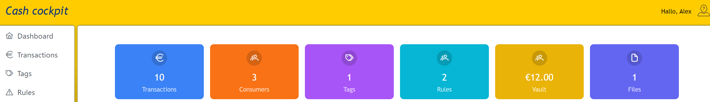

# cash-cockpit

+ This project was originally intended to be a financial manager that I created on my own and in my free time.
+ The goal was to develop my programming skills and have control and oversight over my financial transactions using a card.
+ This version of the project is not the original; it has been rewritten several times.
+ At the moment, it is functional, but in the stage of further development, there is still a lot of functionality that I would like to implement.
+ This project runs on my Raspberry Pi 4 around the clock within my local network.

### Do you want to run it locally? You need:
- docker
- git
- keyboard, web browser and internet (only for pull images) :)

#### Step One: Choose a Folder for the Repository and Download It
> git clone https://github.com/RtCryo/cash-cockpit.git
#### Step Two: Initiate the Build and Wait for Completion.
> docker compose up

OR you can build native image's(it may take 10-15 minutes, depending on your PC, as native code compilation is performed using GraalVM):
> docker compose -f docker-compose.yaml -f docker-compose.native.yaml up
#### Step Three: The service is accessible at cash-cockpit.local. However, you still need to add rules to the host file.
#### Step Four: Adding Host Entry
+ Open your system's hosts file using a text editor with administrative privileges. You can use nano, vim, or any other preferred text editor.
+ Add the following line to the hosts file:
    - Linux/Mac: The hosts file is usually located at `/etc/hosts`. You can open it using a text editor with administrative privileges.
    - Windows: The hosts file is located at `C:\Windows\System32\drivers\etc\hosts`. You'll need administrative privileges to edit it.
> 127.0.0.1 cash-cockpit.local
+ Save the hosts file.
#### Step Five: Open a web browser and navigate to 
> http://cash-cockpit.local
